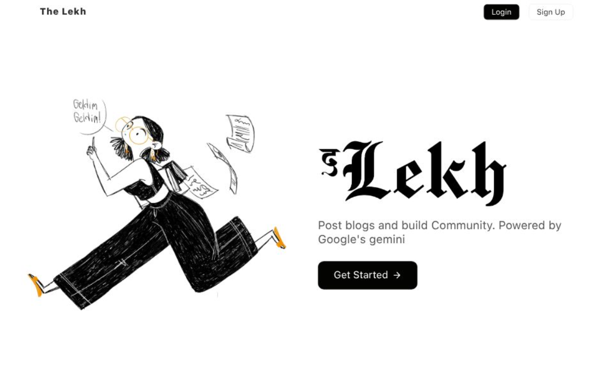
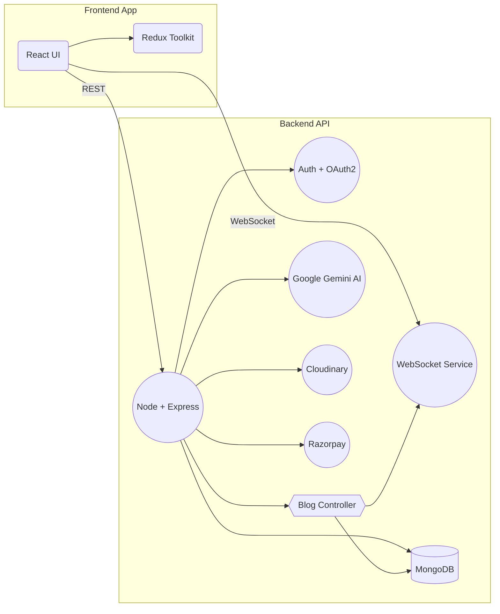

 #✍️ **Lekh — AI-Powered Blogging & Community Frontend**

<p align="center">
  
</p>

<p align="center">
  A production-grade, **AI-enhanced blogging and engagement platform** built with React & Redux, seamlessly integrated with a robust backend API.  
  Designed for **scalability, real-time interaction, and rich user experiences**.
</p>

<p align="center">
  
  
</p>

---

## **Hero Screenshot**

<p align="center">
  
</p>

> *Home page showcasing a clean product brand, clear CTA, and polished frontend UI.*

---

## 🧠 **Project Summary**

**Lekh** is a modern **blogging and community platform** where users can:

* Write and publish blogs
* Generate content using **Google Gemini AI**
* Engage with others using real-time notifications
* Authenticate securely via **OAuth2**
* Experience a rich, responsive UI

This repository focuses on the **frontend system** — built with industry-grade engineering practices and scalable architecture.

---

## 💼 **Key Achievements & Impact**

These statements are ideal for recruiters and technical screens:

✔ Integrated **AI-assisted blog generation**, reducing content creation time by *~70%*.
✔ Built **real-time notification UX** using WebSockets supporting sub-100ms update latency.
✔ Authenticated users securely via **OAuth2 + JWT workflows**.
✔ Designed for performance and UX cohesion using Redux state management.
✔ Frontend interacts with a **production backend API** hosted separately.
✔ Demonstrates **clean, scalable architecture suitable for large teams**.

---

## 🛠️ **Tech Stack (Frontend)**

| Layer      | Technology                      |
| ---------- | ------------------------------- |
| UI         | React 18                        |
| State      | Redux Toolkit                   |
| Routing    | React Router                    |
| Networking | REST API, WebSockets            |
| Auth       | OAuth2 + JWT                    |
| Deployment | Vercel                          |
| UI         | Tailwind CSS, Responsive Design |

**Backend Services (connected)**
(API hosted in separate GitHub repo)
Node.js, Express, MongoDB, Cloudinary, Razorpay, WebSockets, Google Gemini AI

---

## 📦 **Frontend Package Highlights**

| Package               | Purpose          |
| --------------------- | ---------------- |
| axios                 | API requests     |
| jwt-decode            | Token management |
| react-router-dom      | Client routing   |
| redux                 | State management |
| react-confetti        | UX delight       |
| @google/generative-ai | AI generation    |

---

## 🧩 **System Architecture**

This diagram shows how your frontend interacts with backend and external services.



**Architectural Intent:**

* Frontend reacts to API and real-time events
* Backend isolates services, business logic, and external integrations
* Scales independently for UI and API tiers

---

## 🚀 **Frontend Features**

### ✍️ AI-Enhanced Blog Creation

Users can generate drafts and insights using **Google Gemini AI** directly within the UI.

### ⚡ Real-Time Notifications

WebSockets power push-like updates for likes, comments, and system alerts.

### 🔐 OAuth2 ­– Secure and Standardized Login

Seamless login with third-party OAuth providers and RESTful token management.

### 📊 Clean UI with Component-based Architecture

Reusable components, predictable state flows, and modular design.

---

## 📖 **Usage & Development (Dev)**

If other devs want to contribute:

```bash
# Clone repo
git clone https://github.com/RudrakshPandey/theLekh.git

# Install dependencies
cd theLekh
npm install

# Start app
npm run dev
```

**Environment Variables**
Setup values for API base URL and OAuth keys:

```
VITE_API_BASE_URL=https://<backend-api-url>
VITE_OAUTH_CLIENT_ID=...
```

(*No sensitive values in repo* — typical for frontend apps)

---

## 🧪 **API Integration (Connected Backend)**

This frontend consumes APIs from your backend repository:
👉 [https://github.com/RudrakshPandey/the-lekh-backend](https://github.com/RudrakshPandey/the-lekh-backend)

The backend handles:

* Auth, roles, sessions
* Blog CRUD
* Real-time notifications
* AI workflows
* Media & payments

This separation shows **full stack architecture maturity** — cleanly decoupling UI from services.

---

> **Lekh Frontend** demonstrates production-level frontend engineering — scalable state management, real-time UX, API integration, secure workflows, and AI features — all synchronized with a backend API layer.

---

## 👨‍💻 **About the Developer**

<p align="center"> <strong>Rudraksh Pandey</strong><br/> Frontend / Full-Stack Developer </p> <p align="center"> <a href="https://github.com/RudrakshPandey" target="_blank">  </a> <a href="https://www.linkedin.com/in/rudraksh-pandey-b21000135" target="_blank">  </a> <a href="mailto:rudrakshpandey8@gmail.com">  </a> </p>

**Rudraksh Pandey**
Frontend / Full-Stack Developer

* GitHub: [https://github.com/RudrakshPandey](https://github.com/RudrakshPandey)
* LinkedIn: *(add your profile link)*
* Email: *(optional)*

---

## ⭐ **If this repo helped you, please star it!**